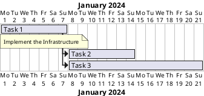

# Project __XXX__

## 1. Scope

This is either done here or in the Design document.

### Project Team

> add your names here
> maybe find a fancy team name

## 2. Project Plan

> insert a list of tasks here
> you can create nice Gantt charts with PlantUml
> update this diagram so that it always displays the current state of your project
> maybe it is a good idea to have one master chart which contains only the US bars, and then a separate diagram per US showing the details.

> define the User Stories, add them here as topics
> each user story will then be broken down into small tasks

#### US1: name

- Design
- Update design document
- Implementation
- Implementation
- Test Good Case
- Test fail 1
- Test fail 2
- ...
- Update project document
- implement integration tests
- do presentation of US

> only when all the tasks are done, the US is ready!

#### US2: name

> add as needed

## 3. Project Log

> here each scrum master adds one chapter for the week he/she is responsible for
> we do scrum development, one sprint is effectively the interval between two lectures.
> scrum master role rotates, so that each sprint a new team member is in charge

### Week xxx

- Scrum Master in charge

- What was planned for this week (you can use the issue numbers and titles of the GIT repo here)
- What has been done
- Who did what, and what was the effort per person (in hours)?

- were there problems?
- what worked good, what shall we improve next week?
- are there any problems which may delay the project? If yes, do we have an idea how to solve them?

> The scrum master is responsible for adding the chapter. However, the whole team must contribute here.
